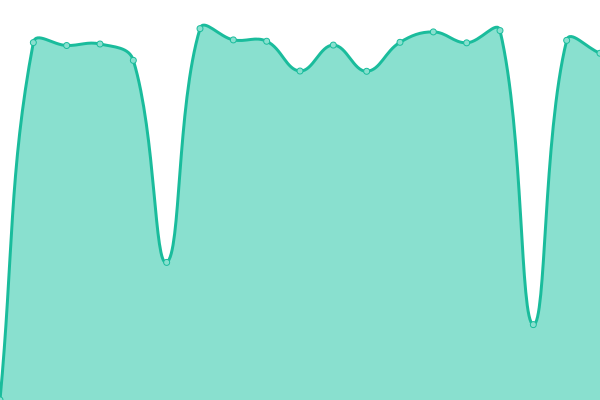

# [📈 Live Status](https://gaplogic.github.io/gaplogic.com): <!--live status--> **🟧 Partial outage**

This repository contains the open-source uptime monitor and status page for [gaplogic](https://gaplogic.github.io/gaplogic.com), powered by [Upptime](https://github.com/upptime/upptime).

With [Upptime](https://upptime.js.org), you can get your own unlimited and free uptime monitor and status page, powered entirely by a GitHub repository. We use [Issues](https://github.com/gaplogic/gaplogic.com/issues) as incident reports, [Actions](https://github.com/gaplogic/gaplogic.com/actions) as uptime monitors, and [Pages](https://gaplogic.github.io/gaplogic.com) for the status page.

<!--start: status pages-->
<!-- This summary is generated by Upptime (https://github.com/upptime/upptime) -->
<!-- Do not edit this manually, your changes will be overwritten -->
<!-- prettier-ignore -->
| URL | Status | History | Response Time | Uptime |
| --- | ------ | ------- | ------------- | ------ |
|  [Gaplogic](https://www.gaplogic.com) | 🟥 Down | [gaplogic.yml](https://github.com/gaplogic/gaplogic.com/commits/HEAD/history/gaplogic.yml) | 

 147ms
     
 | 

<a href="https://gaplogic.github.io/gaplogic.com/history/gaplogic">0.00%</a>
    

|  [Facturasgratis](https://www.facturasgratis.ml) | 🟥 Down | [facturasgratis.yml](https://github.com/gaplogic/gaplogic.com/commits/HEAD/history/facturasgratis.yml) | 

 0ms
     
 | 

<a href="https://gaplogic.github.io/gaplogic.com/history/facturasgratis">0.00%</a>
    

|  [La Casa Agency](https://www.lacasa.net/) | 🟩 Up | [la-casa-agency.yml](https://github.com/gaplogic/gaplogic.com/commits/HEAD/history/la-casa-agency.yml) | 

 2948ms
     
 | 

<a href="https://gaplogic.github.io/gaplogic.com/history/la-casa-agency">100.00%</a>
    

|  [Pablo Furchi](http://pablofurchi.com/) | 🟥 Down | [pablo-furchi.yml](https://github.com/gaplogic/gaplogic.com/commits/HEAD/history/pablo-furchi.yml) | 

 3906ms
     
 | 

<a href="https://gaplogic.github.io/gaplogic.com/history/pablo-furchi">97.28%</a>
    

<!--end: status pages-->

[**Visit our status website →**](https://gaplogic.github.io/gaplogic.com)

## 📄 License

- Powered by: [Upptime](https://github.com/upptime/upptime)
- Code: [MIT](./LICENSE) © [gaplogic](https://gaplogic.github.io/gaplogic.com)
- Data in the `./history` directory: [Open Database License](https://opendatacommons.org/licenses/odbl/1-0/)
